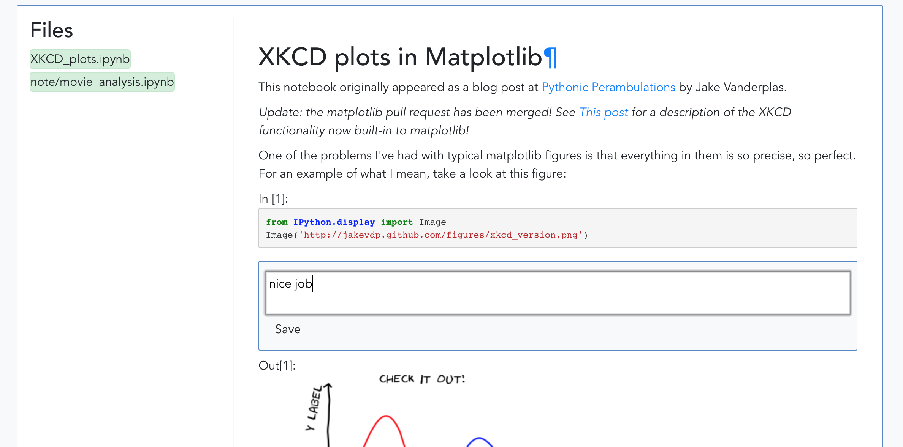
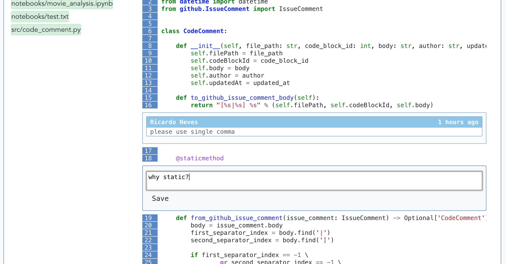

Koopera
=========

**Koopera** is a collaboration app that enables Data Science teams to share and review their jupyter notebooks.

# Features
* Review jupyter notebooks by commenting directly on its cells
* Review source code with syntax highlight for python, scala, etc.
* Import notebooks from your GitHub repositories
* Navigate through your notebooks
* GitHub authentication via personal access token

# Screenshots

**Review jupyter notebooks**

<kbd></kbd> 

**Review python code**

<kbd></kbd> 

**Import and navigate through your notebooks**

<kbd></kbd> 

# Quickstart
You can easily start using Koopera with docker in just two steps.

1. Build and start Koopera + dependencies:

    `docker-compose up --build -d`

1. Run migrations:

    `docker-compose run --rm koopera alembic upgrade head`

When the migration ends, you can now access Koopera at: [http://0.0.0.0:8080](http://0.0.0.0:8080)

# Setting up dev environment

## Dependencies
* Python 3.6
* nodejs 10

## Setting up backend for local development

1. Enable CORS by setting `ALLOW_CORS` to `True` in [src/backend/config.py](src/backend/config.py)

2. Create virtualenv

    `python -m venv venv`

3. Activate virtualenv

    `source venv/bin/activate`

4. Install dependencies

    `pip install -r requirements.txt`

5. Run migrations
    `alembic upgrade head`

6. Start flask app on default port (5000)

    `python run.py`

## Setting up frontend for local development

1. Install dependencies

    `npm install`
2. Run web server for serving frontend

    `npm run serve`

A web server for serving frontend with hot reload will be listening on
[http://localhost:8080](http://localhost:8080)

# Credits

Icons made by <a href="https://www.flaticon.com/authors/nikita-golubev" title="Nikita Golubev">Nikita Golubev</a> from <a href="https://www.flaticon.com/"                 title="Flaticon">www.flaticon.com</a> is licensed by <a href="http://creativecommons.org/licenses/by/3.0/"                 title="Creative Commons BY 3.0" target="_blank">CC 3.0 BY</a>

